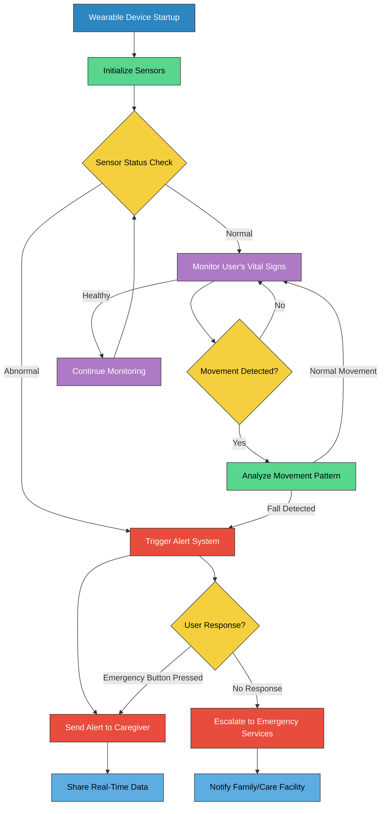

# SIH 2024 - Tilchattaas: Eldicare - AI-Enabled Fall Prevention System for Elderly

### Smart India Hackathon 2024

- **Problem Statement ID**: SIH1580
- **Title**: Wearable Sensor with Artificial Intelligence for Fall Prevention in Elderly People
- **Theme**: MedTech / BioTech / HealthTech
- **Category**: Hardware
- **Team ID**: 18731
- **Team Name**: Tilchattaas

## Project Overview

Eldicare is a wearable, AI-powered system designed to prevent falls among the elderly. This device uses advanced sensors, including a gyroscope, accelerometer, SPO2, and heart rate sensors, to provide real-time monitoring and alert caregivers during emergencies.

## Key Features

- **Fall Prediction**: Detects and predicts falls, immediately alerting caregivers.
- **Vital Monitoring**: Tracks heart rate and oxygen saturation (SPO2) in real-time.
- **Emergency Button**: Allows the user to send an alert manually if needed.
- **Smart Home Integration**: Connects with emergency alarms and smart home systems.

## Flowchart of Working

## Technical Approach

- **Gyroscope & Accelerometer**: Measures body orientation (X, Y, Z axis) and detects rapid movements or instability.
- **Auto-Reboot**: Prevents false readings by resetting the device periodically.
- **GSM Module**: Ensures connectivity and emergency alerts, even without a smartphone.

## Challenges & Solutions

- **Data Reliability**: Custom dataset development for accurate fall detection.
- **False Readings**: Mitigated by periodic auto-reboots.
- **Communication**: GSM integration ensures connectivity without requiring a smartphone.

## Demo of Android App

https://github.com/user-attachments/assets/2b0fa7b2-f813-4a12-aa6c-b92efee35c8e

The Android app complements the wearable device by displaying real-time data, providing alerts to caregivers, and tracking the user's health status. Key app features include:

- **Real-Time Monitoring**: Displays current vital signs and movement data.
- **Alert Notifications**: Caregivers receive instant alerts in case of a fall or emergency.
- **Emergency Contact Integration**: Allows quick access to emergency contacts.
- **History Tracking**: Logs previous alerts and health data for review.

## Benefits and Impact

- **Increased Safety**: Reduces fall risk, increasing confidence in daily activities.
- **Lower Healthcare Costs**: Minimizes fall-related hospital visits.
- **Caregiver Support**: Automated alerts reduce monitoring strain on caregivers.
- **Enhanced Independence**: Enables elderly individuals to live independently.
- **Health Monitoring**: Early detection of potential health issues.
- **Affordable and Scalable**: Suitable for homes and care facilities.

## Research and References

- GitHub Repository: [SIH2024-Tilchattaas](https://github.com/shashaaankkkkk/SIH2024-Tilchattaas)
- Relevant Research:
  - [HealthResearch on Fall Risks](https://journals.lww.com/jtrauma/abstract/2006/02000/a_simple_fall_in_the_elderly__not_so_simple.3.aspx)
  - [NIH Study on Fall Prevention](https://www.ncbi.nlm.nih.gov/pmc/articles/PMC9213836/)
  - Google Books: _Promoting Health and Wellness in the Geriatric Patient_ by David A Soto
